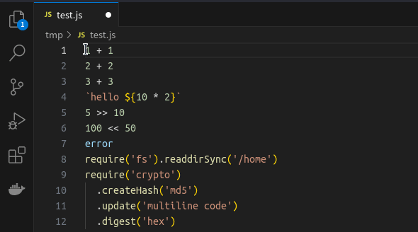

# linode

It runs nodejs for each selections and append the results.

## TL;DR



```javascript
while (selections)  
  eval(selection)
```

## Requirements

[>= Node.js 20.10.0 LTS](https://nodejs.org)

## Risks of `eval()`

**IMPORTANT** Node.js `eval` function can be dangerous.
There Is No Limitation This Extension. use careful. ( like `fs` )

There are a variety of issues with the vulnerability, but the following documents provide a brief overview.

* [Code injection](https://en.wikipedia.org/wiki/Code_injection)
* [Why is using 'eval' a bad practice?](https://stackoverflow.com/questions/1832940/why-is-using-eval-a-bad-practice)
